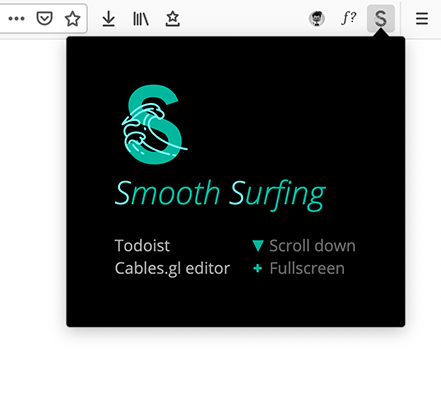

 

# Smooth Surfing <small style="color:lightgrey">FireFox addon</small>
Small website injections that make my browsing experience smoother.  

# Testing
1. about:debugging
2. This Firefox
3. Load temporary Add-on
3. Select: background-script.js

# Packaging
- Build: `cd src && web-ext build`
  - Installation: `npm install --global web-ext`
  - Docs: https://extensionworkshop.com/documentation/develop/getting-started-with-web-ext/